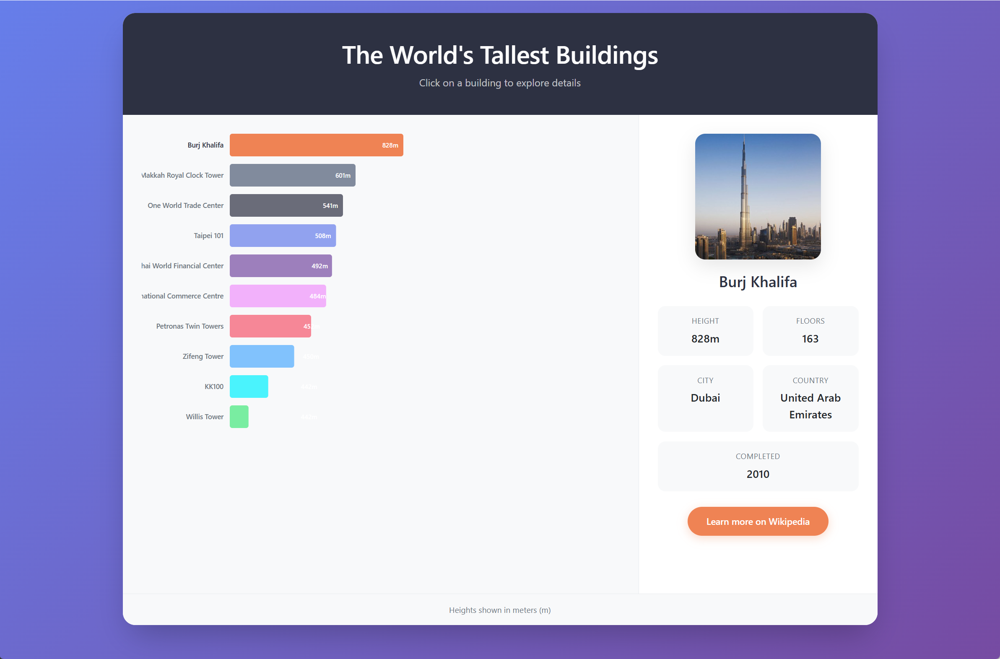

# The World's Tallest Buildings

An interactive data visualization showcasing the world's 10 tallest buildings with animated charts and detailed building information.

## Demo

**[View Live Demo](https://supergokou.github.io/The-World-s-Tallest-Buildings/)**

## Screenshot



## Features

- **Animated Bar Chart** - Bars animate on load with staggered timing and unique colors
- **Interactive Selection** - Click any bar or building name to view details
- **Building Details** - View height, floors, city, country, and completion year
- **Wikipedia Links** - Direct links to learn more about each building
- **Responsive Design** - Works on desktop and mobile devices
- **Smooth Transitions** - Image crossfade and selection highlighting

## Buildings Included

| Rank | Building | City | Height |
|------|----------|------|--------|
| 1 | Burj Khalifa | Dubai | 828m |
| 2 | Makkah Royal Clock Tower | Mecca | 601m |
| 3 | One World Trade Center | New York | 541m |
| 4 | Taipei 101 | Taipei | 508m |
| 5 | Shanghai World Financial Center | Shanghai | 492m |
| 6 | International Commerce Centre | Hong Kong | 484m |
| 7 | Petronas Twin Towers | Kuala Lumpur | 452m |
| 8 | Zifeng Tower | Nanjing | 450m |
| 9 | Willis Tower | Chicago | 442m |
| 10 | KK100 | Shenzhen | 442m |

## Tech Stack

- HTML5
- CSS3 (Flexbox, Grid, CSS Variables)
- Bootstrap 5.3
- D3.js v6

## Project Structure

```
├── index.html
├── css/
│   ├── bootstrap.min.css
│   └── style.css
├── js/
│   └── main.js
├── data/
│   └── buildings.csv
└── img/
    └── [building images]
```

## Getting Started

1. Clone the repository
   ```bash
   git clone https://github.com/supergokou/The-World-s-Tallest-Buildings.git
   ```

2. Open `index.html` in your browser


